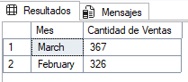

# Análisis Exploratorio de Datos (EDA) - Amazon 2025

Este documento resume el análisis exploratorio realizado sobre la base de datos de ventas de Amazon, utilizando consultas SQL y visualizaciones generadas a partir de los resultados.

***

## 1. Preguntas de Negocio y Consultas SQL

### **¿Qué productos se venden más?**
```sql
SELECT TOP 5
    Product AS 'Producto',
    SUM(Quantity) AS 'Cantidad Vendida'
FROM 
    dbo.Amazon_TB
GROUP BY
    Product
ORDER BY
    SUM(Quantity) DESC;
```


***

### **¿Qué categoría vende más?**
```sql
SELECT TOP 1
    Category AS 'Categoria',
    SUM(Quantity) AS 'Cantidades Vendidas'
FROM 
    dbo.Amazon_TB
GROUP BY
    Category
ORDER BY
    SUM(Quantity) DESC;
```


***

### **¿Cuáles son los meses con más ventas?**
```sql
SELECT TOP 2
    Month AS 'Mes',
    SUM(Quantity) AS 'Cantidad de Ventas'
FROM
    dbo.Amazon_TB
GROUP BY
    Month
ORDER BY
    SUM(Quantity) DESC;
```


***

### **¿En qué ciudad/país/región se hicieron más ventas?**
```sql
SELECT TOP 1
    Customer_Location AS 'City',
    SUM(Quantity) AS 'Numero de Ventas'
FROM 
    dbo.Amazon_TB
GROUP BY
    Customer_Location
ORDER BY
    SUM(Quantity) DESC;
```


***

### **¿Cómo cambian las ventas totales según las categorías de producto?**
```sql
SELECT
    Category AS 'Categoria',
    SUM(Total_Sales) AS 'Ventas Totales'
FROM
    dbo.Amazon_TB
GROUP BY
    Category
ORDER BY
    [Ventas Totales] DESC;
```


***

### **¿Se compran más productos en promedio con cierto método de pago?**
```sql
SELECT
    Payment_Method AS 'Método de Pago',
    AVG(Quantity) AS 'Promedio de Productos Comprados'
FROM
    dbo.Amazon_TB
GROUP BY
    Payment_Method
ORDER BY
    [Promedio de Productos Comprados] DESC;
```


***

## 2. Resumen Visual

A continuación se muestran las principales visualizaciones generadas a partir de los resultados SQL.  
Cada imagen se encuentra en la carpeta `./src/image/` y corresponde a los análisis anteriores.

- 
- 
- 
- 
- 
- 

***

## 3. Conclusiones

- Las ventas se concentran en ciertos productos y categorías.
- Hay meses y ciudades con mayor volumen de ventas.
- El método de pago puede influir en la cantidad promedio de productos comprados.
- El análisis SQL permite identificar patrones clave para la toma de decisiones.

***